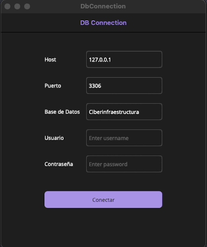

# DB Connection

Test application for MacOS and Windows built with .NET MAUI. 
This is a simple form that includes the required fields to connect to a local database.

### Features
- Performs a `nullOrEmpty` validaation for each input.
- Creates a basic connection to any local MySQL database.
- If the connection was successfully stablished, it returns the list of the existing tables; otherwise, it returns the error message.

### Demo

### How to run in VS Code

1. Install the C# Dev Kit ([official guide](https://code.visualstudio.com/docs/csharp/get-started))
2. Set up .NET MAUI ([official guide](https://learn.microsoft.com/en-us/dotnet/maui/get-started/installation?view=net-maui-9.0&tabs=visual-studio-code))
3. Run with: `dotnet build -t:Run -f net9.0-maccatalyst`