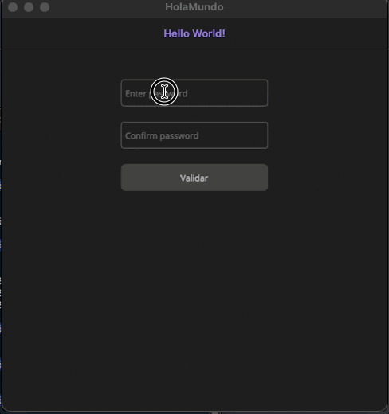

# Hola Mundo

Test application for macOS built with .NET MAUI.  
This is a simple form to validate two passwords.

### Features

- The button is disabled if either of the inputs is empty.
- Validates if both passwords match.
- The regex checks if password contains:
  - `(?=.*[A-Z])` At least one uppercase letter
  - `(?=.*[a-z])` At least one lowercase letter
  - `(?=.*\d)` At least one digit
  - `(?=.*[\W_])` At least one special character (non-word character or underscore)

### Demo

### How to run in VS Code

1. Install the C# Dev Kit ([official guide](https://code.visualstudio.com/docs/csharp/get-started))
2. Set up .NET MAUI ([official guide](https://learn.microsoft.com/en-us/dotnet/maui/get-started/installation?view=net-maui-9.0&tabs=visual-studio-code))
3. Run with: `dotnet build -t:Run -f net9.0-maccatalyst`