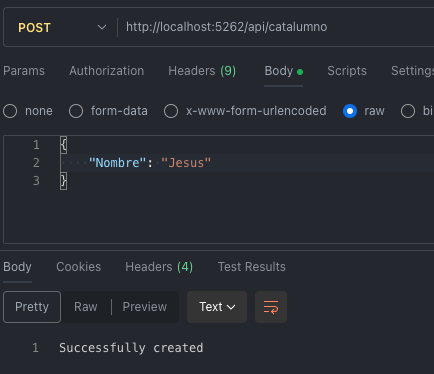
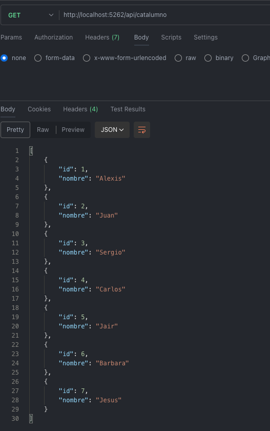
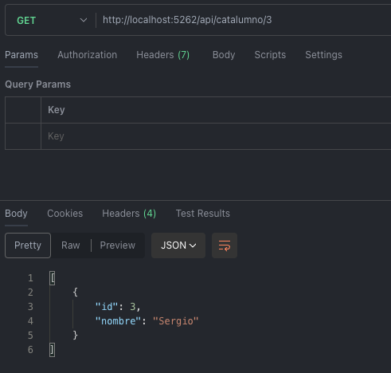

# Web Service

Test API with ASP.NET Core.

### Features

- Conection to PostgreSQL.
- Endpoints to get and create items.

### Demo

1. Get all items:

2. Create new item:

3. Get all including created item:

4. Get item by id:

### How to run in VS Code

1. Install the C# Dev Kit ([official guide](https://code.visualstudio.com/docs/csharp/get-started))
2. Install  `Npgsql.EntityFrameworkCore.PostgreSQL` if it's not automatically installed with:
  `dotnet add package Npgsql.EntityFrameworkCore.PostgreSQL --version 9.0.4`
3. Build with: `dotnet build`
4. Run with: `dotnet run`